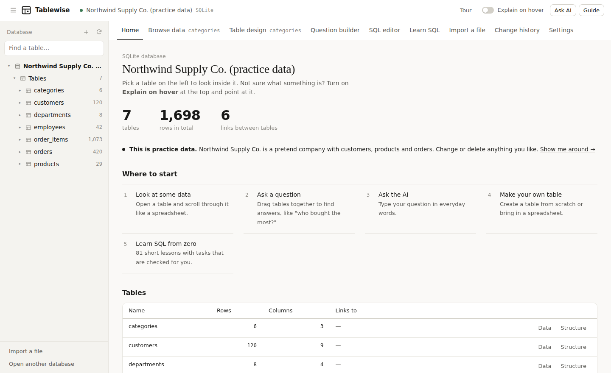
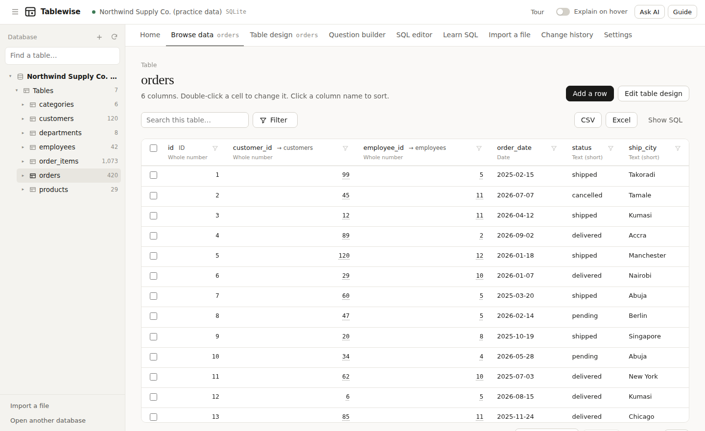
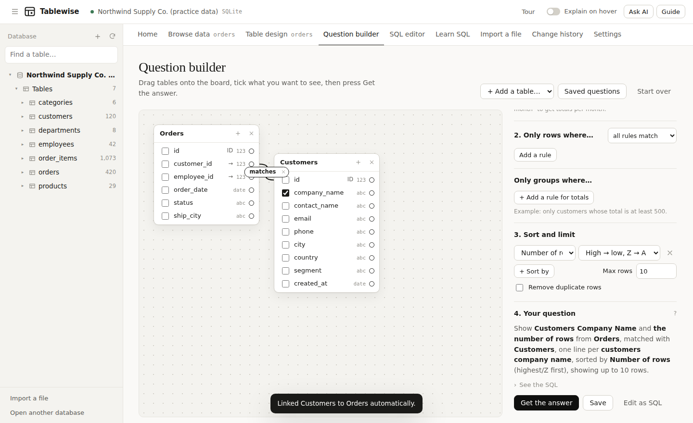
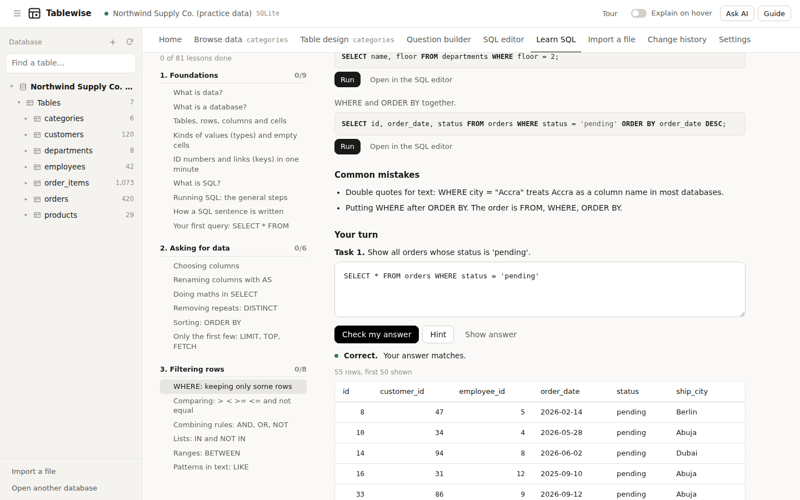

# Tablewise

A simple, beginner-friendly database manager for Windows. Browse, filter, add, edit and delete data like a spreadsheet, build questions by drag and drop, and learn SQL from zero with the built-in course. No SQL knowledge needed.



## Download

Get **Tablewise-Setup-1.3.0.exe** from the [Releases](../../releases/latest) page and double-click it.

- Windows 10 or 11, 64-bit.
- Windows may say "Windows protected your PC" because the installer isn't signed. Click **More info**, then **Run anyway**.

## What it does

- **Browse data.** A spreadsheet-style grid with an easy Filter button, sorting, and adding, editing and deleting rows.
- **Question builder.** Drag and drop tables and columns to ask questions without writing SQL.
- **SQL editor.** For when you want it: a library of 130+ SQL functions, autocomplete and "How will it run?".
- **Table design.** Create and change tables, columns and relationships.
- **Import a file.** Bring in CSV or Excel files.
- **Learn SQL.** A full course from absolute beginner to advanced, explained like you're five, with practice on a private copy.
- **Help panel.** Guide, course, AI assistant and glossary. Dock it left or right, or let it float.
- **Explain on hover.** Point at anything to see what it does.
- **AI assistant.** Works with Claude, ChatGPT, Gemini, GitHub Models or a local Ollama model, using your own key.
- **Databases.** SQLite files, PostgreSQL, MySQL/MariaDB and Microsoft SQL Server.
- **Safety.** Read-only mode, undo, a change history, and it asks before deleting.





## Build it yourself

You need Node.js 20 or newer.

```
cd desktop
npm install
cd ..
node build.mjs            # builds the app page into desktop/app
cd desktop
npm start                 # run the app
npx electron-builder --win nsis --x64   # make the Windows installer in desktop/release
```

`node build.mjs` also writes `dist/tablewise.html`, a single-page browser version that works with SQLite only.

## Project layout

- `src/` – the app (plain JavaScript, HTML and CSS)
- `desktop/` – the Electron wrapper: database drivers, saved connections and AI calls
- `test/` – Playwright checks

© Fiifi Kaasiebrew. All rights reserved.
